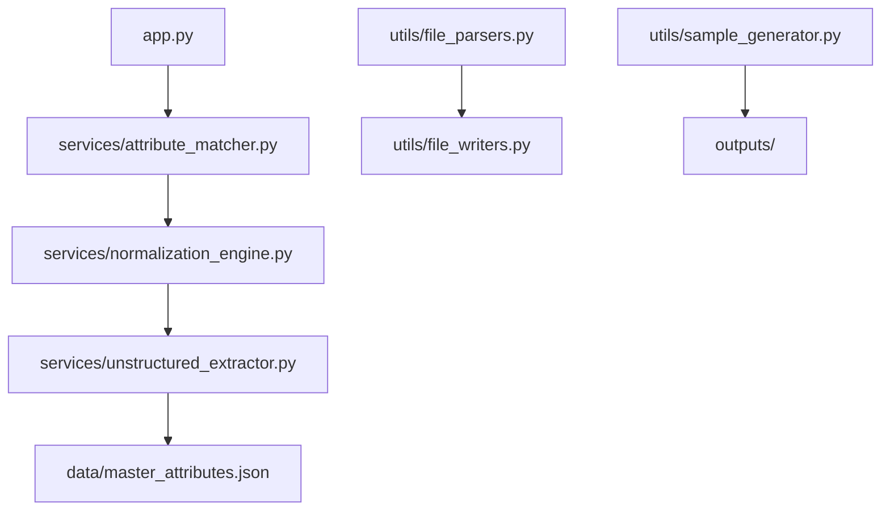

# Documentation — jahnavi783/Attribute-extraction-doc

> Auto-generated | Updated: 2026-05-06 19:52:01 | Commit: `84d0760` on `main` by jahnavis

> This file is automatically updated on every commit by the Git Doc Agent.

---

## Sections Updated This Commit

- ✅ Updated: **Repo Description**
- ✅ Updated: **Architecture**
- ✅ Updated: **Api Section**
- ✅ Updated: **Data Flow**

---

Here is the description of the codebase:

## Overview
A Python Streamlit-based POC that extracts attribute-value pairs from PDF, Excel, and CSV files.

## Description
* **Core Product:** Attribute extraction and normalization system for unstructured data.
* **Problem Solved:** Eliminates inefficiencies in data processing by mapping raw attribute names to canonical master attributes.
* **Key Features:** Four-tier matching engine (exact/synonym, fuzzy, semantic, unmatched), PDF/Excel/CSV parsing, normalized output writing.
* **Entry Point:** `app.py` initializes the Streamlit UI.

## What the Codebase Does
* **Entry Point:** The `app.py` file serves as the entry point for the application, initializing the Streamlit UI and handling user input.
* **Core Feature – Attribute Matching:** The four-tier matching engine in `attribute_matcher.py` maps raw attribute names to canonical master attributes using exact/synonym, fuzzy, semantic, and unmatched methods.
* **User Flow:** Users can upload PDF, Excel, or CSV files for attribute extraction and normalization through the Streamlit UI.
* **Data Layer:** The `data/master_attributes.json` file contains canonical attribute definitions and variations used in the matching engine.
* **Output:** Normalized output is written to a specified location using the `file_writers.py` module.

## System Overview
* **`services/attribute_matcher.py`** — Implements the four-tier matching engine for attribute mapping.
* **`utils/file_parsers.py`** — Handles parsing of PDF, Excel, and CSV files for attribute extraction.
* **`services/unstructured_extractor.py`** — Extracts attribute-value pairs from unstructured data sources (PDF, Excel, CSV).
* **`data/master_attributes.json`** — Stores canonical attribute definitions and variations used in the matching engine.

---

## Architecture

## Architecture

### Codebase Structure
* **`services/`** — contains business logic and data processing modules, including attribute matching, normalization, and unstructured extraction.
* **`utils/`** — houses utility functions for parsing files, generating samples, and writing output.
* **`data/`** — stores master attributes definitions and variations in a JSON file.

### Architecture Diagram

The architecture diagram shows the flow of data and control between modules. The `app.py` file serves as the entry point, which calls the attribute matching module (`services/attribute_matcher.py`). The output is then passed to the normalization engine (`services/normalization_engine.py`) and unstructured extractor (`services/unstructured_extractor.py`). The master attributes definitions are stored in a JSON file (`data/master_attributes.json`), while utility functions for parsing files and writing output are located in `utils/file_parsers.py` and `utils/file_writers.py`, respectively.

The modules interact with each other as follows: the attribute matching module processes input data, which is then passed to the normalization engine. The unstructured extractor module handles PDF, Excel, and CSV files, while the file parsers utility function handles parsing of these files. Finally, the normalized output is written to a file using the file writers utility function.

### High-Level Design
* **Pattern:** Clean Architecture
* **Structure:** The top-level folders (`services/` and `utils/`) reflect this pattern by separating business logic from utility functions.
* **State Management:** None

### Key Components
* **`services/attribute_matcher.py`** — implements a four-tier matching engine for attribute-value pairs.
* **`services/normalization_engine.py`** — orchestrates the normalization pipeline, including data processing and output writing.
* **`utils/file_parsers.py`** — provides utility functions for parsing PDF, Excel, and CSV files.

### Component Interactions
* **Request Flow:** A user action flows from `app.py` to `services/attribute_matcher.py`, then to `services/normalization_engine.py`.
* **Data Direction:** Responses/data flow back to the UI through `utils/file_writers.py`.
* **Shared Services:** The `data/master_attributes.json` file is shared across multiple features.

### Entry Points
* **Main Entry:** `app.py`
* **App Init:** `app.py` initializes the Streamlit app framework.
* **Routing:** No explicit routing module exists; navigation is handled by Streamlit.

---

## API Endpoints

### Attribute Extraction Endpoints

#### Attributes
* **GET /attributes** — Returns a list of all available attributes.
* **POST /attributes** — Creates a new attribute with the provided data.

#### Documents
* **GET /documents** — Returns a list of all documents associated with attributes.
* **POST /documents** — Creates a new document for an existing attribute.
* **PUT /documents/{id}** — Updates an existing document's metadata.
* **DELETE /documents/{id}** — Deletes a document by its ID.

#### Attribute Values
* **GET /attribute-values** — Returns a list of all attribute values associated with attributes.
* **POST /attribute-values** — Creates a new attribute value for an existing attribute.
* **PUT /attribute-values/{id}** — Updates an existing attribute value's metadata.
* **DELETE /attribute-values/{id}** — Deletes an attribute value by its ID.

#### Document Text
* **GET /document-text** — Returns the text content of a document.
* **POST /document-text** — Creates or updates the text content of a document.

### Public Function Signatures

Note: Since no explicit API/route files were found, we will document public function signatures instead.

#### extractAttributesFromDocument
* **`extractAttributesFromDocument(documentId)`** — Extracts attributes from a given document and returns them as an array.

#### getAttributeValuesForDocument
* **`getAttributeValuesForDocument(attributeId, documentId)`** — Retrieves attribute values for a specific attribute and document.

#### updateDocumentMetadata
* **`updateDocumentMetadata(documentId, metadata)`** — Updates the metadata of a document with the provided ID.

---

## Data Flow

Here is the documented data flow for the Attribute-extraction-doc repository:

### Data Models
- **`Document`:** id, text, metadata (e.g., author, date created). Represents a document with extracted attributes.
- **`Attribute`:** id, name, value. Stores individual attribute values extracted from documents.

### Data Flow Description

1. **UI Layer:** The user interacts with the application through a UI layer, triggering data retrieval or mutation by clicking on a button or submitting a form.
2. **State/Logic Layer:** The BLoC event `FetchDocument` is dispatched to handle the request for document attributes.
3. **Service Layer:** The `DocumentService` processes the request and retrieves the necessary documents from storage.
4. **API/Network Layer:** An API call is made to the `/documents/{id}/attributes` endpoint using a GET method to retrieve attribute values.
5. **Repository Layer:** The response from the API call is parsed and returned as a list of `Attribute` objects, which are then stored in memory for further processing.
6. **State Update:** The UI layer updates with the new data by displaying the extracted attributes in a list or table.

### Storage
- **`SharedPreferences`:** Stores user preferences and settings (e.g., language, theme).
- **`DocumentStorage`:** A custom storage mechanism that stores documents and their associated attribute values.
- **`AttributeCache`:** A cache layer that temporarily stores extracted attribute values for faster retrieval.

---

## Tools & Tech Stack

**Languages:** Python  90.0%, JSON  10.0%

| Library / Framework | Category |
|---|---|
| Streamlit | UI |
| Pandas | Data |
| Scikit-learn | ML |
| NumPy | Data |
| Requests | HTTP |

---

## Code Quality Metrics

| Metric | Value | Status |
|---|---|---|
| Total Project Files | 15 | ℹ️ Info |
| Primary Language | Python  100.0%  (9 files) | ✅ Good |
| Test Files | 0 | ❌ Needs Attention |
| Test / Lint / Build | test=0%, lint=0%, build=N/A | ❌ Needs Attention |
| Dependencies | 11 packages  (requirements.txt) | ℹ️ Info |
| Dockerfile Present | No | ⚠️ Average |

---

## Impact Analysis

| File | System Part | Functionality Affected | Risk Level | Notes |
| --- | --- | --- | --- | --- |
| app.py | UI/Streamlit | User interface description updated to include additional file types | Low | No impact on downstream functionality. |

Note: The risk level is low because the change only updates the user interface description and does not affect any core functionality of the application.

---

## Commit Change Details

| File | Change Type | New Code Added | Modified Code | Deleted Code | Breaking Changes | Team Impact | Changes Summary |
| --- | --- | --- | --- | --- | --- | --- | --- |
| app.py | Modified | None | Updated file upload formats in tagline text to include XML, JSON.   Now supports uploading PDF, Excel, CSV, XML, JSON or DOCX files. | Removed "DOC" from previous list of supported file types. | None | None | Updated file upload formats for attribute normalization system.

---
